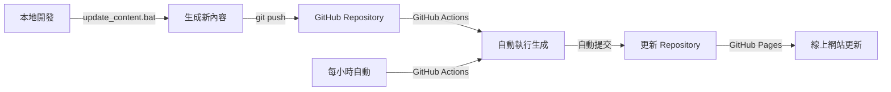

# Regular Comix

自動從 Google News 擷取新聞主題，產生四格漫畫腳本並以語音播報。使用 GitHub Actions 每小時自動執行，並部署到 GitHub Pages。

## 🌐 線上預覽

**[🎭 訪問 Regular Comix 網站](https://YOUR_USERNAME.github.io/regular-comix/)**

## 功能特色

- 📰 自動從 Google News RSS 擷取熱門新聞
- 🎭 使用 Google Gemini AI 生成幽默的四格漫畫腳本
- 🔊 將腳本轉換為中文語音檔案
- ⏰ 每小時自動執行（透過 GitHub Actions）
- 📁 自動保存結果到 `outputs/` 目錄
- 🚀 自動部署到 GitHub Pages
- 📱 響應式網頁設計，支援手機和桌面
- 🖥️ 本地 Web 界面，支援完美中文顯示

## 🚀 快速開始

### 方法一：使用整合啟動器（推薦）

```bash
# 雙擊執行或在命令列執行
launcher.bat          # Windows 批次檔
launcher.ps1          # PowerShell 腳本
python launcher.py    # Python 腳本
```

整合啟動器提供以下功能：
- 🚀 生成新的漫畫腳本與語音
- 🌐 啟動網頁界面查看結果
- 📂 開啟結果資料夾
- 📊 快速預覽最新結果
- 🧹 清理舊檔案

### 方法二：直接執行（傳統方式）

### 🌐 部署到 GitHub Pages（線上自動化）

1. **Fork 或複製此 repository**
2. **設定 API 金鑰**: 在 Repository Settings > Secrets 中新增 `GOOGLE_API_KEY`
3. **啟用 GitHub Pages**: 在 Settings > Pages 中選擇 "Deploy from a branch" > `main` / `docs`
4. **等待自動部署**: GitHub Actions 會每小時自動生成內容並部署

詳細部署指南請參考 [DEPLOY.md](DEPLOY.md)

### � 本地開發與測試

**快速上手（Windows 使用者）：**
```bash
# 1. 克隆專案
git clone <your-repo-url>
cd regular-comix

# 2. 安裝依賴
pip install -r requirements.txt

# 3. 設定 API 金鑰（複製 .env.example 為 .env 並填入金鑰）
cp .env.example .env

# 4. 選擇使用方式：

# 方式A：生成內容並在靜態網站查看
./update_content.bat        # 生成新內容 + 更新索引
# 然後在 VS Code 中開啟 docs/index.html 使用 Live Server

# 方式B：啟動本地開發伺服器
./start_web.bat            # 啟動 Flask 伺服器，訪問 http://127.0.0.1:5000
```

## 設定指南

### 1. 設定 Google AI API 金鑰

1. 前往 [Google AI Studio](https://makersuite.google.com/app/apikey)
2. 建立新的 API 金鑰
3. 在 GitHub 專案的 Settings > Secrets and variables > Actions 中
4. 新增 Repository secret：
   - Name: `GOOGLE_API_KEY`
   - Value: 你的 API 金鑰

### 2. 啟用 GitHub Actions

GitHub Actions 工作流程會自動：
- 每小時執行一次
- 生成新的漫畫腳本和語音檔案
- 自動提交並推送到 repository

### 3. 手動執行

你也可以在 GitHub 的 Actions 頁面手動觸發工作流程。

## 本地開發

1. 克隆專案：
```bash
git clone <your-repo-url>
cd regular-comix
```

2. 安裝依賴：
```bash
pip install -r requirements.txt
```

3. 設定環境變數：
```bash
# 建立 .env 檔案
echo "GOOGLE_API_KEY=your_api_key_here" > .env
```

4. 執行程式：
```bash
python main.py
```

## 🔄 本地端查看新生成的結果

當您在本地端生成新的四格漫畫後，有兩種方法可以立即查看 `docs/outputs/` 底下的新結果：

### 方法 1：靜態網站 + Live Server（推薦）

**🔧 使用 `update_content.bat` 一鍵更新**
```bash
# Windows 系統直接執行
./update_content.bat
```

這個批次檔會自動執行：
1. `python main.py` - 生成新的四格漫畫腳本和語音檔案
2. `python generate_file_list.py` - 更新 `docs/file-list.json`，讓靜態網站能正確載入新內容

**適用時機：**
- ✅ 想要快速生成新內容並立即在網頁上查看
- ✅ 準備將更新推送到 GitHub Pages
- ✅ 需要更新檔案索引以便網頁正確載入

**查看結果：**
- 在 VS Code 中開啟 `docs/index.html`
- 右鍵選擇 "Open with Live Server" 
- 或直接用瀏覽器開啟 `file:///完整路徑/docs/index.html`
- 選擇最新的時間批次查看新內容

### 方法 2：動態網站 Flask 應用

**🚀 使用 `start_web.bat` 啟動本地伺服器**
```bash
# Windows 系統直接執行
./start_web.bat
```

這個批次檔會：
1. 切換到 `web/` 目錄
2. 啟動 Flask 開發伺服器（`python app.py`）
3. 在 `http://127.0.0.1:5000` 提供網頁服務

**適用時機：**
- ✅ 開發和測試階段，需要即時查看生成結果
- ✅ 不想手動更新檔案清單（Flask 會自動掃描檔案）
- ✅ 需要更豐富的本地開發體驗
- ✅ 測試網頁功能和樣式

**查看結果：**
- 瀏覽器自動打開 `http://127.0.0.1:5000`
- 自動掃描所有檔案，無需手動更新檔案清單
- 支援即時重新載入

### 🎯 方法比較

| 特點 | 靜態網站 (方法 1) | 動態網站 (方法 2) |
|------|------------------|------------------|
| **設定難度** | 簡單 | 簡單 |
| **檔案更新** | 需執行 `update_content.bat` | 自動掃描檔案 |
| **依賴** | VS Code Live Server 或瀏覽器 | Flask |
| **效能** | 快速 | 稍慢 |
| **適用場景** | 生產環境、GitHub Pages | 本地開發測試 |
| **推薦度** | ⭐⭐⭐⭐⭐ | ⭐⭐⭐⭐ |

## 🌐 GitHub Actions 自動化與 GitHub Pages 部署

### GitHub Actions 工作流程

專案已設定自動化工作流程 (`.github/workflows/regular-comix.yml`)：

**⏰ 自動執行時機：**
- 每小時執行一次 (`cron: '0 * * * *'`)
- 可在 GitHub Actions 頁面手動觸發

**🔄 自動化流程：**
1. **Setup** - 設定 Python 3.11 環境
2. **Install** - 安裝依賴套件 (`pip install -r requirements.txt`)
3. **Generate** - 執行 `python main.py` 生成新內容
4. **Update** - 自動更新檔案清單
5. **Commit** - 提交新生成的檔案到 repository
6. **Deploy** - GitHub Pages 自動部署更新

### GitHub Pages 設定

**📋 設定步驟：**

1. **Repository Settings**
   - 前往 `Settings > Pages`
   - Source 選擇 "Deploy from a branch"
   - Branch 選擇 `main` / `docs` folder

2. **環境變數設定**
   - 前往 `Settings > Secrets and variables > Actions`
   - 新增 `GOOGLE_API_KEY` (必要)

3. **GitHub Actions 權限設定**
   - 前往 `Settings > Actions > General`
   - 在 "Workflow permissions" 區域
   - 選擇 "Read and write permissions"
   - 勾選 "Allow GitHub Actions to create and approve pull requests"

4. **自動部署**
   - 每次 GitHub Actions 執行完成後
   - GitHub Pages 會自動重新部署
   - 通常在 2-5 分鐘內完成

**🔗 查看結果：**
- 網站網址：`https://YOUR_USERNAME.github.io/regular-comix/`
- 部署狀態：Repository 首頁右側的 "Deployments" 區域
- 執行記錄：Actions 頁面查看每次執行的詳細記錄

**📊 內容更新週期：**
- **自動更新**：每小時生成 5 個新的四格漫畫腳本
- **即時同步**：本地端 `update_content.bat` → GitHub Push → 自動部署
- **手動觸發**：Actions 頁面的 "Run workflow" 按鈕

### 本地與線上的同步流程



## 📂 檔案結構

```
regular-comix/
├── .github/workflows/
│   └── regular-comix.yml        # GitHub Actions 自動執行工作流程
├── docs/                        # GitHub Pages 靜態網站檔案
│   ├── index.html              # 網站主頁
│   ├── style.css               # 網站樣式
│   ├── script.js               # 網站功能
│   ├── file-list.json          # 檔案索引（由 generate_file_list.py 生成）
│   └── outputs/                # 生成的檔案（GitHub Pages 可直接存取）
│       └── YYYYMMDD_HHMM/      # 按時間戳分組
│           ├── *.txt           # 漫畫腳本
│           └── *.mp3           # 語音檔案
├── main.py                      # 主程式：生成漫畫腳本和語音
├── generate_file_list.py        # 生成檔案清單工具
├── 📝 update_content.bat        # 【重要】一鍵更新腳本（生成+索引）
├── 🚀 start_web.bat            # 【重要】啟動本地 Flask 伺服器
├── requirements.txt             # Python 依賴
├── .env                        # 環境變數（本地開發用）
├── DEPLOY.md                    # 部署指南
└── web/                        # 本地開發用 Flask 應用
    ├── app.py                  # Flask 後端
    ├── templates/              # HTML 範本
    └── static/                 # 靜態資源

重要批次檔說明：
├── update_content.bat          # 🔄 生成新內容 + 更新索引
│   ├── → python main.py       # 生成漫畫腳本和語音
│   └── → python generate_file_list.py  # 更新 file-list.json
└── start_web.bat              # 🌐 啟動本地網頁伺服器
    └── → cd web && python app.py      # 啟動 Flask 應用
```

## 技術棧

- **Python 3.11+**
- **Google Generative AI (Gemini)** - 生成漫畫腳本
- **Google Text-to-Speech (gTTS)** - 語音合成
- **Beautiful Soup** - RSS 解析
- **GitHub Actions** - 自動化執行和部署
- **GitHub Pages** - 靜態網站託管
- **HTML/CSS/JavaScript** - 前端網頁介面

## 🎯 使用說明

### 線上使用

1. 訪問 [GitHub Pages 網站](https://YOUR_USERNAME.github.io/regular-comix/)
2. 選擇想要查看的生成批次
3. 閱讀漫畫腳本
4. 播放或下載語音檔案

### 本地開發

參考上方的「本地開發」章節設定。

## 📈 監控和維護

- **執行狀態**: 查看 GitHub Actions 頁面
- **網站流量**: 查看 GitHub Insights
- **API 使用量**: 監控 Google AI API 額度

## 🤝 貢獻

歡迎提交 Pull Request 或建立 Issue 來改善這個項目！

## �️ 最新功能

### 整合啟動器 (launcher.py)
提供一個統一的中文界面來管理所有功能：
- 🚀 生成新的漫畫腳本與語音
- 🌐 啟動網頁界面查看結果  
- 📂 開啟結果資料夾
- 📊 快速預覽最新結果
- 🧹 清理舊檔案

**使用方法：**
```bash
launcher.bat          # Windows 批次檔
launcher.ps1          # PowerShell 腳本（更好的中文支援）
python launcher.py    # Python 腳本（跨平台）
```

### 中文顯示優化
- ✅ PowerShell 腳本完全支援中文
- ✅ 網頁界面使用 Noto Sans TC 字體
- ✅ 終端機自動設定 UTF-8 編碼
- ✅ 所有輸出內容正確顯示中文

### Web 界面改進
- 📱 響應式設計，支援行動裝置
- 🎨 美觀的漸層背景與卡片設計
- 🔊 內建音訊播放器
- 📅 時間批次選擇器
- 📄 直接下載腳本與音檔

## �📄 授權

MIT License - 詳見 [LICENSE](LICENSE) 檔案
