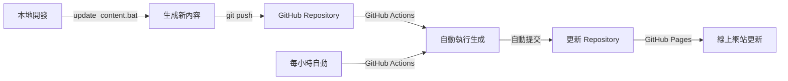

# Regular Comix

🎭 自動從 Google News 擷取新聞主題，使用 AI 生成幽默的四格漫畫腳本，並轉換為中文語音播報。支援本地運行和自動化部署。

## ✨ 功能特色

- 📰 **智能新聞擷取** - 從 Google News RSS 自動獲取熱門新聞
- 🤖 **AI 創作腳本** - 使用 Google Gemini AI 生成幽默四格漫畫
- 🔊 **語音播報** - 將腳本轉換為高質量中文語音
- �️ **完整界面** - 提供友好的命令行和網頁界面
- 📱 **響應式設計** - 支援桌面和移動設備
- ⚙️ **一鍵啟動** - 多種啟動方式，操作簡單
- 📁 **自動管理** - 智能文件組織和清理功能

## 🚀 快速開始

### ⭐ 推薦方式：一鍵啟動

```bash
# Windows 用戶（推薦）
雙擊 launcher.bat

# 或使用 PowerShell
.\launcher.ps1

# 或直接使用 Python
python launcher.py
```

### 📋 整合啟動器功能

啟動器提供完整的交互式選單：

1. **🚀 生成新內容** - 自動抓取新聞並生成漫畫腳本
2. **🌐 啟動網頁界面** - 在瀏覽器中查看所有結果
3. **📂 開啟結果文件夾** - 快速訪問生成的文件
4. **📊 預覽最新結果** - 查看最近生成的內容
5. **🧹 清理舊文件** - 自動清理 30 天前的文件

### 🔧 系統要求

- **Python 3.8+**
- **Google AI API Key** (免費申請)
- **網絡連接** (用於新聞擷取和 AI 服務)

**快速上手（Windows 使用者）：**
```bash
# 1. 克隆專案
git clone <your-repo-url>
## 📦 安裝指南

### 1. 克隆項目

```bash
git clone <your-repo-url>
cd regular-comix
```

### 2. 安裝依賴

```bash
pip install -r requirements.txt
```

### 3. 設定 Google AI API 金鑰

1. 前往 [Google AI Studio](https://makersuite.google.com/app/apikey) 免費申請 API 金鑰
2. 複製 `.env.example` 為 `.env`：
   ```bash
   cp .env.example .env
   ```
3. 編輯 `.env` 文件，填入您的 API 金鑰：
   ```
   GOOGLE_API_KEY=your_api_key_here
   ```

### 4. 開始使用

```bash
# Windows 用戶 - 雙擊啟動
launcher.bat

# 或使用 Python 直接啟動
python launcher.py
```

## 🎯 使用說明

### 實時進度顯示

程序運行時會顯示詳細的進度信息：

```
🚀 開始生成漫畫腳本 - 20250701_2005
==================================================
📰 正在從 Google News 獲取新聞...
🌐 嘗試獲取新聞 (第 1/3 次)...
📡 連接到 Google News RSS...
✅ 網絡請求成功！
📄 正在解析 RSS 內容...
📰 找到 87 個新聞項目，正在篩選...
✅ 成功篩選出 5 個優質新聞主題

🎯 處理主題 1/5
📢 主題：某某新聞標題
------------------------------
📝 正在為主題生成四格漫畫腳本...
🤖 正在呼叫 Google Gemini AI... (第 1 次)
✅ AI 腳本生成成功！
💾 正在保存腳本和生成語音...
🔊 正在生成中文語音（可能需要幾秒鐘）...
✅ 語音已保存
✅ 主題 1 處理完成！
```

### 輸出文件結構

```
docs/outputs/
└── 20250701_2005/          # 時間戳文件夾
    ├── 新聞標題1.txt        # 漫畫腳本
    ├── 新聞標題1.mp3        # 語音文件
    ├── 新聞標題2.txt
    ├── 新聞標題2.mp3
    └── ...
```
```

3. 設定環境變數：
```bash
# 建立 .env 檔案
echo "GOOGLE_API_KEY=your_api_key_here" > .env
```

4. 執行程式：
```bash
python main.py
```

## 🔄 本地端查看新生成的結果

當您在本地端生成新的四格漫畫後，有兩種方法可以立即查看 `docs/outputs/` 底下的新結果：

### 方法 1：靜態網站 + Live Server（推薦）

**🔧 使用 `update_content.bat` 一鍵更新**
```bash
# Windows 系統直接執行
./update_content.bat
```

這個批次檔會自動執行：
1. `python main.py` - 生成新的四格漫畫腳本和語音檔案
2. `python generate_file_list.py` - 更新 `docs/file-list.json`，讓靜態網站能正確載入新內容

**適用時機：**
- ✅ 想要快速生成新內容並立即在網頁上查看
- ✅ 準備將更新推送到 GitHub Pages
- ✅ 需要更新檔案索引以便網頁正確載入

**查看結果：**
- 在 VS Code 中開啟 `docs/index.html`
- 右鍵選擇 "Open with Live Server" 
- 或直接用瀏覽器開啟 `file:///完整路徑/docs/index.html`
- 選擇最新的時間批次查看新內容

### 方法 2：動態網站 Flask 應用

**🚀 使用 `start_web.bat` 啟動本地伺服器**
```bash
# Windows 系統直接執行
./start_web.bat
```

這個批次檔會：
1. 切換到 `web/` 目錄
2. 啟動 Flask 開發伺服器（`python app.py`）
3. 在 `http://127.0.0.1:5000` 提供網頁服務

**適用時機：**
- ✅ 開發和測試階段，需要即時查看生成結果
- ✅ 不想手動更新檔案清單（Flask 會自動掃描檔案）
- ✅ 需要更豐富的本地開發體驗
- ✅ 測試網頁功能和樣式

**查看結果：**
- 瀏覽器自動打開 `http://127.0.0.1:5000`
- 自動掃描所有檔案，無需手動更新檔案清單
- 支援即時重新載入

### 🎯 方法比較

| 特點 | 靜態網站 (方法 1) | 動態網站 (方法 2) |
|------|------------------|------------------|
| **設定難度** | 簡單 | 簡單 |
| **檔案更新** | 需執行 `update_content.bat` | 自動掃描檔案 |
| **依賴** | VS Code Live Server 或瀏覽器 | Flask |
| **效能** | 快速 | 稍慢 |
| **適用場景** | 生產環境、GitHub Pages | 本地開發測試 |
| **推薦度** | ⭐⭐⭐⭐⭐ | ⭐⭐⭐⭐ |

## 🌐 GitHub Actions 自動化與 GitHub Pages 部署

### GitHub Actions 工作流程

專案已設定自動化工作流程 (`.github/workflows/regular-comix.yml`)：

**⏰ 自動執行時機：**
- 每小時執行一次 (`cron: '0 * * * *'`)
- 可在 GitHub Actions 頁面手動觸發

**🔄 自動化流程：**
1. **Setup** - 設定 Python 3.11 環境
2. **Install** - 安裝依賴套件 (`pip install -r requirements.txt`)
3. **Generate** - 執行 `python main.py` 生成新內容
4. **Update** - 自動更新檔案清單
5. **Commit** - 提交新生成的檔案到 repository
6. **Deploy** - GitHub Pages 自動部署更新

### GitHub Pages 設定

**📋 設定步驟：**

1. **Repository Settings**
   - 前往 `Settings > Pages`
   - Source 選擇 "Deploy from a branch"
   - Branch 選擇 `main` / `docs` folder

2. **環境變數設定**
   - 前往 `Settings > Secrets and variables > Actions`
   - 新增 `GOOGLE_API_KEY` (必要)

3. **GitHub Actions 權限設定**
   - 前往 `Settings > Actions > General`
   - 在 "Workflow permissions" 區域
   - 選擇 "Read and write permissions"
   - 勾選 "Allow GitHub Actions to create and approve pull requests"

4. **自動部署**
   - 每次 GitHub Actions 執行完成後
   - GitHub Pages 會自動重新部署
   - 通常在 2-5 分鐘內完成

**🔗 查看結果：**
- 網站網址：`https://YOUR_USERNAME.github.io/regular-comix/`
- 部署狀態：Repository 首頁右側的 "Deployments" 區域
- 執行記錄：Actions 頁面查看每次執行的詳細記錄

**📊 內容更新週期：**
- **自動更新**：每小時生成 5 個新的四格漫畫腳本
- **即時同步**：本地端 `update_content.bat` → GitHub Push → 自動部署
- **手動觸發**：Actions 頁面的 "Run workflow" 按鈕

### 本地與線上的同步流程



## 📂 檔案結構

```
regular-comix/
├── .github/workflows/
│   └── regular-comix.yml        # GitHub Actions 自動執行工作流程
├── docs/                        # GitHub Pages 靜態網站檔案
│   ├── index.html              # 網站主頁
│   ├── style.css               # 網站樣式
│   ├── script.js               # 網站功能
│   ├── file-list.json          # 檔案索引（由 generate_file_list.py 生成）
│   └── outputs/                # 生成的檔案（GitHub Pages 可直接存取）
│       └── YYYYMMDD_HHMM/      # 按時間戳分組
│           ├── *.txt           # 漫畫腳本
│           └── *.mp3           # 語音檔案
├── main.py                      # 主程式：生成漫畫腳本和語音
├── generate_file_list.py        # 生成檔案清單工具
├── 📝 update_content.bat        # 【重要】一鍵更新腳本（生成+索引）
├── 🚀 start_web.bat            # 【重要】啟動本地 Flask 伺服器
├── requirements.txt             # Python 依賴
├── .env                        # 環境變數（本地開發用）
├── DEPLOY.md                    # 部署指南
└── web/                        # 本地開發用 Flask 應用
    ├── app.py                  # Flask 後端
    ├── templates/              # HTML 範本
    └── static/                 # 靜態資源

重要批次檔說明：
├── update_content.bat          # 🔄 生成新內容 + 更新索引
│   ├── → python main.py       # 生成漫畫腳本和語音
│   └── → python generate_file_list.py  # 更新 file-list.json
└── start_web.bat              # 🌐 啟動本地網頁伺服器
    └── → cd web && python app.py      # 啟動 Flask 應用
```

## 技術棧

- **Python 3.11+**
- **Google Generative AI (Gemini)** - 生成漫畫腳本
- **Google Text-to-Speech (gTTS)** - 語音合成
- **Beautiful Soup** - RSS 解析
- **GitHub Actions** - 自動化執行和部署
- **GitHub Pages** - 靜態網站託管
- **HTML/CSS/JavaScript** - 前端網頁介面

## 🎯 使用說明

### 線上使用

1. 訪問 [GitHub Pages 網站](https://YOUR_USERNAME.github.io/regular-comix/)
2. 選擇想要查看的生成批次
3. 閱讀漫畫腳本
4. 播放或下載語音檔案
## 🌐 自動化部署 (GitHub Pages)

### 設置步驟

1. **Fork 此項目**
2. **設定 API 金鑰**：
   - 前往 Repository Settings > Secrets and variables > Actions
   - 新增 Repository secret：
     - Name: `GOOGLE_API_KEY`
     - Value: 您的 Google AI API 金鑰

3. **啟用 GitHub Pages**：
   - 前往 Settings > Pages
   - Source 選擇 "Deploy from a branch"
   - Branch 選擇 `main` / `docs`

4. **等待自動部署**：
   - GitHub Actions 會每小時自動執行
   - 生成新的漫畫腳本和語音檔案
   - 自動提交並推送到 repository

### 監控和維護

- **執行狀態**: 查看 GitHub Actions 頁面
- **API 使用量**: 監控 Google AI API 額度
- **網站訪問**: `https://YOUR_USERNAME.github.io/regular-comix/`

## 🔧 技術架構

### 核心組件

- **新聞擷取**: Google News RSS + BeautifulSoup
- **AI 生成**: Google Gemini 2.0 Flash
- **語音合成**: Google Text-to-Speech (gTTS)
- **網頁界面**: Flask + 響應式設計
- **自動化**: GitHub Actions

### 文件結構

```
regular-comix/
├── launcher.py          # 主啟動器
├── launcher.bat         # Windows 批次啟動器
├── launcher.ps1         # PowerShell 啟動器
├── main.py             # 核心邏輯
├── requirements.txt    # Python 依賴
├── .env.example       # 環境變數範例
├── web/               # 網頁界面
│   ├── app.py         # Flask 應用
│   ├── templates/     # HTML 模板
│   └── static/        # CSS/JS 資源
├── docs/              # 靜態網站
│   ├── index.html     # 主頁面
│   └── outputs/       # 生成的內容
└── .github/workflows/ # GitHub Actions
```

## 📝 更新記錄

### v1.0.0 穩定版 (2025-07-01)

#### ✨ 新功能
- **完整的啟動器系統** - 提供三種啟動方式 (bat/ps1/py)
- **實時進度顯示** - 詳細的執行狀態和進度提示
- **智能錯誤處理** - 網絡重試和異常恢復機制
- **交互式選單** - 友好的中文操作界面

#### 🔧 改進
- **中文編碼優化** - 解決 Windows 終端中文顯示問題
- **輸入處理優化** - 修復交互式輸入無響應問題
- **文件管理** - 自動創建時間戳文件夾
- **API 調用優化** - 增加重試機制和錯誤提示

#### 🧹 維護
- **代碼清理** - 移除調試和測試文件
- **文檔更新** - 完善 README 和使用指南
- **版本標記** - 建立穩定版本標籤

#### 🎯 使用體驗
- **一鍵啟動** - 雙擊 `launcher.bat` 即可開始
- **實時反饋** - 每個步驟都有清楚的進度提示
- **多種選項** - 生成內容、查看結果、清理文件等

## 🤝 貢獻指南

歡迎提交 Pull Request 或建立 Issue！

1. Fork 此項目
2. 創建功能分支: `git checkout -b feature/amazing-feature`
3. 提交更改: `git commit -m 'Add amazing feature'`
4. 推送分支: `git push origin feature/amazing-feature`
5. 開啟 Pull Request

## 📄 授權

MIT License - 詳見 [LICENSE](LICENSE) 檔案
